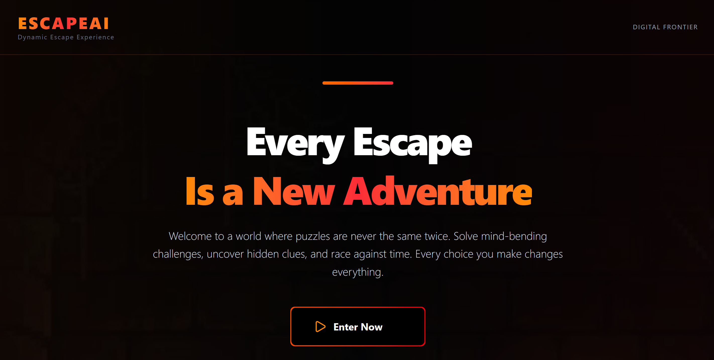
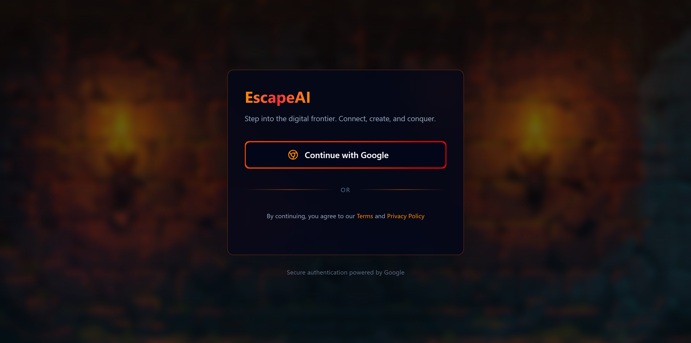
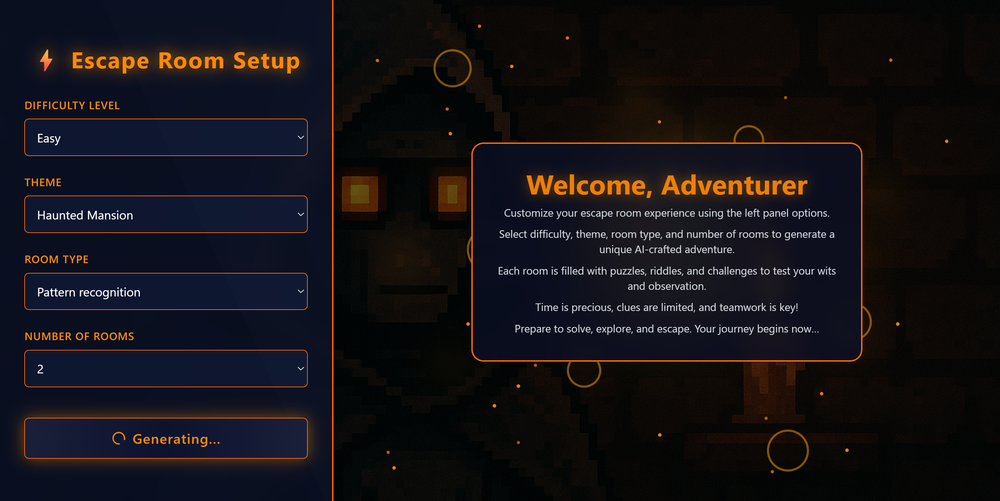
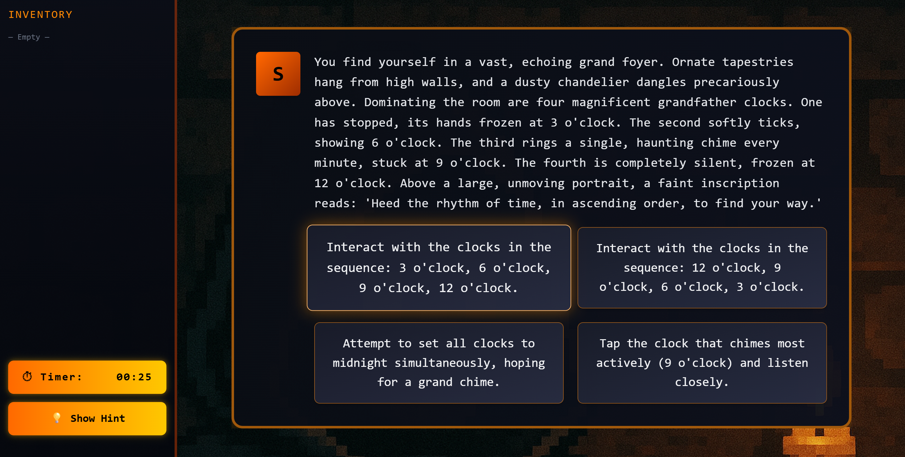
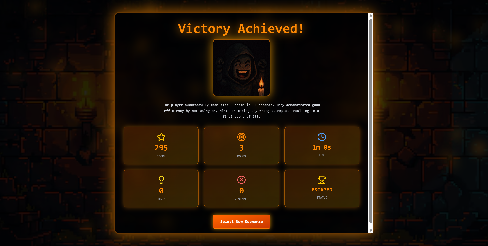
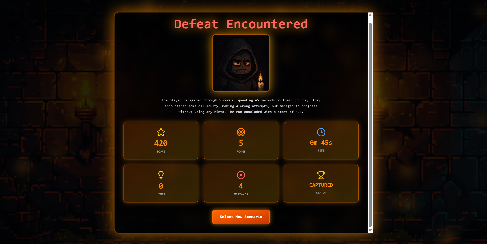

# EscapeAI: The AI-Powered Escape Room Experience

## Overview
EscapeAI is an immersive, story-driven escape room experience that uses artificial intelligence to create dynamic storylines and personalized challenges.  Every player’s journey is unique, shaped by their decisions and the AI’s storytelling.

---

## About the Project
EscapeAI was designed to bring together the thrill of puzzle-solving and the creativity of AI-driven narratives. Instead of following a fixed storyline, players are guided through evolving scenarios that adapt to their choices. The system generates new rooms, story branches, and endings based on player interactions, ensuring no two sessions are ever the same.

The platform includes the following key sections:

### 1. Landing Page



### 2. Login Page


### 3. Room Selection Page


### 4. Game Screen


### 5. Result Page




---

## Core Features
- Dynamic story generation using Gemini AI, adapting to player choices in real time.
- Secure Google authentication for login and session tracking.
- Fully responsive and interactive user interface with animations and transitions.
- Persistent game session management with MongoDB integration.
- Real-time data exchange between frontend and backend for smooth gameplay.
- AI-based summarization of gameplay to generate personalized endings.

---

## Tech Stack

### Frontend
- **React.js** for component-based UI
- **Tailwind CSS** for modern styling
- **Framer Motion** for animations and transitions
- **Axios** for API communication

### Backend
- **Node.js** and **Express.js** for server and API management
- **MongoDB** with **Mongoose** for database operations
- **Google Gemini API** for AI-driven content generation
- **JWT** for secure user session handling

---

## Setup Instructions

### Backend Setup
1. Navigate to the backend folder:
   ```bash
   cd backend
   ```
2. Install dependencies:
   ```bash
   npm install
   ```
3. Create a `.env` file and add the following configuration:
   ```env
   PORT=5000
   MONGO_URI=your_mongodb_connection_string
   GEMINI_API_KEY=your_google_genai_api_key
   JWT_SECRET=your_jwt_secret
   CLIENT_URL=http://localhost:5173
   ```
4. Start the backend server:
   ```bash
   npm run dev
   ```

### Frontend Setup
1. Navigate to the frontend folder:
   ```bash
   cd frontend
   ```
2. Install dependencies:
   ```bash
   npm install
   ```
3. Add a `.env` file with the backend URL (optional):
   ```env
   VITE_GOOGLE_CLIENT_ID = "YOUR_GOOGLE_CLIENT_ID"
   VITE_API_URL = "http://localhost:8080"
   ```
4. Run the frontend application:
   ```bash
   npm run dev
   ```

---

## AI Service Integration

The backend integrates Google’s Gemini API for the following functions:

| AI Service | Description |
|-------------|--------------|
| **Story Plan** | Generates the entire narrative outline |
| **Initial Room** | Builds the first scene and challenges |
| **Next Room** | Produces the next scene based on player’s choice |
| **Summary** | Creates a conclusion and performance summary |

All AI responses are JSON-validated before being stored in MongoDB.

---

## API Endpoints

### Authentication
| Method | Endpoint | Description |
|--------|-----------|-------------|
| POST | `/api/auth/login` | Login using Google |
| POST | `/api/auth/refresh` | Refresh JWT token |
| GET | `/api/auth/me` | Fetch logged-in user profile |

### Game Routes
| Method | Endpoint | Description |
|--------|-----------|-------------|
| POST | `/api/game/start` | Start a new AI escape session |
| POST | `/api/game/choose` | Submit user choice and get next room |
| POST | `/api/game/summary/:sessionId` | Get AI summary for a session |
| GET | `/api/game/current` | Get current session data |

### Session Routes
| Method | Endpoint | Description |
|--------|-----------|-------------|
| GET | `/api/session/history/all` | Fetch all previous sessions |
| GET | `/api/session/:id` | Fetch a specific session |

---


## How It Works

1. **Start the Game:** When a player begins, the backend requests the Gemini API to generate a story plan and the first room.
2. **Player Choices:** Each choice is sent to the backend, which triggers the AI to produce the next room based on context and decisions.
3. **Session Management:** The player’s progress is stored in MongoDB, ensuring continuity and history tracking.
4. **Game Summary:** Once the player reaches the end, the AI generates a complete story summary with insights into the path taken.

---

## Future Enhancements
- Multiplayer cooperative escape experiences.
- Visual and sound integration for immersive storytelling.
- Leaderboards and performance-based achievements.
- Advanced memory-based AI story continuity across sessions.


